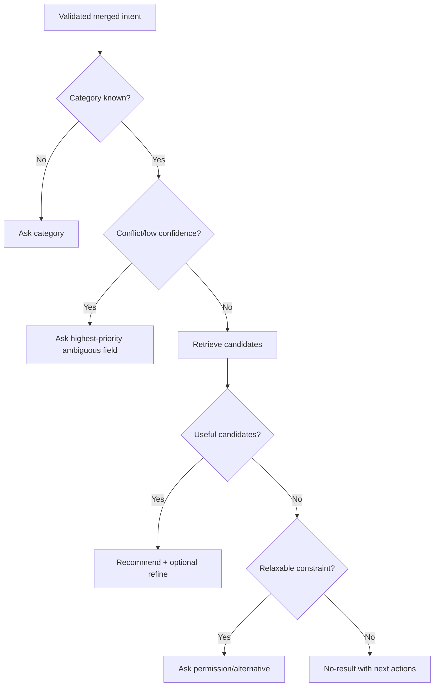

# Clarification policy (đề xuất)

## Mục tiêu

Hỏi ít nhất có thể để recommendation có ích, không buộc người dùng điền mọi sở thích. Current state chưa có clarification; service hiện trả rule-based no-result hoặc recommendation ngay (`backend/services/aiAdvisor.service.js:687-786`).

## Decision policy

Hỏi **một câu chính** khi: category không xác định; category quá rộng và candidate vượt ngưỡng (ví dụ >30); intent mâu thuẫn; confidence <0.60; candidate=0 nhưng bỏ một hard constraint có thể giúp. Không hỏi khi category+candidate đủ, thiếu field chỉ là soft preference, hoặc có thể trả top N trước rồi mời refine.

Ưu tiên: 1 category, 2 budget, 3 room/use case, 4 style, 5 size, 6 color/material. Không hỏi lại field đã biết và không hỏi hơn 2 clarification liên tiếp; sau 2 lần, trả kết quả tốt nhất theo constraints hiện có hoặc no-result minh bạch.

## No-result và anti-pattern

Nếu không có sản phẩm còn hàng trong budget, nói rõ constraint nào gây rỗng và chỉ nới **một** field: ví dụ “Bạn muốn tăng ngân sách hay xem mẫu cùng loại hết hàng?” Không âm thầm bỏ stock/budget/category. Không hỏi “màu, chất liệu, kích thước, phòng, phong cách” trong cùng lượt; không biến “tôi cần sofa” thành form bắt buộc.

Ví dụ: “Bàn” → hỏi use case nếu candidate quá rộng. “Sofa dưới 10 triệu” → recommend nếu có, không hỏi màu. “Loại rẻ hơn” không có reference → hỏi “Bạn muốn rẻ hơn mẫu nào hoặc ngân sách tối đa?”
