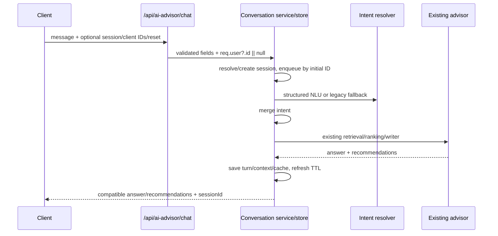

# Phase C.5 — Audit Conversation Session

## Scope and method

Audit-only review of the Phase C controller, conversation services, intent services, AI route/rate limiter, tests and Phase 1 documents. No production code, contract, schema, dependency, database, or frontend code was changed in this audit. Findings below refer to the source state reviewed on branch `codex/ai-phase-a-characterization`.

## Current session flow

Evidence: validation and orchestration entry are `backend/controllers/aiAdvisor.controller.js:4-18`; session processing is `backend/services/aiConversation.service.js:18-45`; retrieval/ranking/writer remain in `backend/services/aiAdvisor.service.js:736-843`.

## Store lifecycle and memory

`AiConversationSessionStore` keeps two unbounded process-local Maps: `sessions` and `queues` (`backend/services/aiConversationSession.store.js:3-4`). A session is a UUID v4 generated with `crypto.randomUUID()` (`backend/services/aiConversation.types.js:6,14-18`); only UUID-shaped strings are looked up (`backend/services/aiConversationSession.store.js:5,19`). Invalid or missing IDs silently create a new session (`backend/services/aiConversation.service.js:19-21`).

TTL is lazy only: `get` removes an expired session (`backend/services/aiConversationSession.store.js:6-8`); `touch` extends expiry from successful completion (`:10`). There is no interval, shutdown hook, global maximum active-session count, byte budget, or eviction policy. Reset deletes the old key (`backend/services/aiConversation.service.js:24-27`), and turn rotation uses the same deletion. `processedMessages` is bounded to 20 (`:42-43`) and `recentTurns` to four summaries (`:39`); `lastRecommendationContext` keeps only compact fields (`:11-14`). No full recommendation DTO is deliberately stored.

### Finding C5-1 — unbounded idle session Map

**Severity: blocker before Phase D if public rollout continues.** A rate-limited attacker can still create up to 10 sessions/IP/15 minutes (`backend/middlewares/publicRateLimit.middleware.js:22`; route `backend/routes/aiAdvisor.routes.js:7`), and distributed IPs can retain them for 24 hours because expiration occurs only when a specific ID is subsequently read. No global cap or periodic lazy sweep exists. The rate limiter reduces but does not bound memory. This is an attacker-controlled 24-hour retention path.

Queues do clean after settled tails (`backend/services/aiConversationSession.store.js:11-19`), including rejection because `finally` releases the next tail. However, a currently hung provider task retains its queue and session until the provider’s own timeout path settles; current NLU and writer use bounded provider timeouts, so this is not an indefinite normal-path lock.

## TTL and turn limit

TTL is inactivity-based, not `createdAt`-based: `touch` sets `updatedAt` and `expiresAt = now + TTL` after result construction (`backend/services/aiConversationSession.store.js:10`, `backend/services/aiConversation.service.js:40-41`). Exact expiry is `expiresAt <= now` (`backend/services/aiConversationSession.store.js:6`). A successful idempotent replay returns at `backend/services/aiConversation.service.js:29` **before** `touch`, so it does not refresh TTL. Failed resolver/retrieval/writer work does not reach `touch` or increment turn count (`:31-43`). This is internally consistent but not documented as a contract.

Turn count increments only after the advisor result (`backend/services/aiConversation.service.js:36-37`), so failures and cached duplicates do not increase it. At existing count 20, the next queued processing rotates first then processes the current message in a new session (`:23-28`). The old session cache is deleted from `sessions` through `store.delete`; however, see reset/rotation race below.

Tests use injected clocks for expiry and turn rotation (`backend/tests/h3.ai-conversation.test.js:47-63`), but do not test exact `expiresAt === now`, idempotent TTL behavior, failure-before-touch, or turn 20/21 concurrency.

## Concurrency and reset timelines

The queue is keyed by the session ID resolved **before** enqueue (`backend/services/aiConversation.service.js:19-23`). Different session IDs run in parallel; there is no global lock. For two ordinary messages with different IDs, both retain the same mutable session object but their queued tasks execute in order, so the second sees mutations from the first.

| Timeline | Actual result | Evidence / risk |
|---|---|---|
| Two messages, different `clientMessageId` | Serialized after both initially resolve the same object; no ordinary lost update. | `aiConversation.service.js:19-23`; test `h3.ai-conversation.test.js:66-80`. |
| Same ID concurrently | First caches at line 42; second wakes and returns cloned cache at line 29, so it avoids a second NLU/retrieval call. | Queue then cache ordering; not directly asserted by a concurrent-duplicate test. |
| Reset then ordinary request already queued on old ID | **Unsafe.** Reset deletes old store key and switches only its local `session` variable to a new session. The waiting ordinary task retains the deleted old session object captured before enqueue, then mutates and returns its obsolete ID. | `aiConversation.service.js:19-27,31-45`. |
| First provider call fails/timeout; second waits | Queue `finally` releases the tail; second runs. Failed first does not mutate turn/cache/TTL. | `aiConversationSession.store.js:17-18`; `aiConversation.service.js:31-43`. No direct test. |
| Turn 20 and 21 arrive near-concurrently | **Unsafe for same reason as reset.** First rotates its local session; second was queued under old ID with old object and can mutate/return the deleted session. | `aiConversation.service.js:19-28`. No test. |

### Finding C5-2 — reset/rotate can resurrect a detached session object

**Severity: blocker before Phase D.** A queued request keeps a closed-over reference to the session object resolved before the first request resets or rotates it. It cannot reinsert the object into `sessions`, but it can process stale context, send stale recommendations, increment its detached turn counter, and return an ID that `store.get` will no longer resolve. This violates reset isolation and creates misleading client state. The same flaw affects reset phrase, `resetSession`, and turn-limit rotation.

## Idempotency

`clientMessageId` is strict-request validated as trimmed 1–64 characters but has no allowed-character restriction (`backend/controllers/aiAdvisor.controller.js:9-12`). Its scope is a session-local `Map` (`backend/services/aiConversation.types.js:18`), bounded by 20 values (`backend/services/aiConversation.service.js:42-43`). Cached values are structurally cloned on both write and read (`:7,29,42`), preventing caller mutation of the stored response. Failures are not cached because caching happens only after successful result construction.

The post-completion duplicate guarantee is implemented. Same-ID concurrent deduplication is logically implied by queue-before-cache ordering, but no direct test asserts resolver/advisor call counts in that scenario. More importantly, duplicate resets are not idempotent: after first reset deletes the supplied old ID, a duplicate request resolves no session at line 19, creates a new one at line 21, and resets again at lines 24–27. It therefore cannot find the cache placed in the first replacement session.

### Finding C5-3 — reset requests are not idempotent across session rotation

**Severity: blocker before Phase D.** A retry of the same `clientMessageId` with `resetSession: true` can create another replacement session and rerun NLU/retrieval. The advertised idempotency rule is not met for this request class.

## Ownership policy

The actual policy is **strict equality by stored owner value**, not claim/transfer: `ownerMatches` compares `session.ownerUserId === ownerUserId` (`backend/services/aiConversation.service.js:8,20-21`). Controller uses `req.user?.id ?? null` (`backend/controllers/aiAdvisor.controller.js:17`), while the route has only the public rate limiter and controller (`backend/routes/aiAdvisor.routes.js:1-7`); no optional authentication middleware is present in that route. Therefore in the current wiring all requests are guest (`null`) unless a global upstream middleware happens to assign `req.user`, which `backend/app.js:80` does not show.

Consequences:

- guest sessions remain guest; an authenticated caller does not auto-claim one;
- an authenticated session used after logout becomes a fresh guest session;
- user B gets a fresh session rather than evidence of user A’s session, so existence/turn/cache are not disclosed;
- reset ownership is checked before entering reset logic (`backend/services/aiConversation.service.js:19-25`).

This matches a strict “guest remains guest” policy, but is only partially exercisable while the route has no optional auth middleware. The current test covers user A/B mismatch (`backend/tests/h3.ai-conversation.test.js:47-63`), not guest-to-auth/logout transition or actual route middleware behavior.

## Reset

Both flag and phrases exist: phrases normalize Vietnamese accents and match four forms (`backend/services/aiConversationReset.service.js:1-3`); reset check precedes idempotency lookup (`backend/services/aiConversation.service.js:23-29`). The current message is processed in the new session. This means a repeated reset request cannot use an existing cache even if it is still attached to the current session: every request with `resetSession: true` rotates before checking `processedMessages`.

The reset phrase also goes to intent extraction after rotation (`backend/services/aiConversation.service.js:31`), so a phrase-only reset receives a normal no-product response and counts as a turn. It does not affect a distinct session ID, but concurrent behavior is blocked by C5-2/C5-3.

## Merge matrix

| Field | Actual behavior | Evidence | Audit result |
|---|---|---|---|
| category, room, style, size, sortPreference | Non-null incoming overwrites only at equal/higher source priority; null retains. | `aiConversationMerge.service.js:10-17` | Correct for retention. “explicit_user” is never produced by current resolver, so only Gemini/legacy priority is active. |
| stockRequired | Only incoming `true` sets; false means retain unless internal clear operation. | `:18` | Cannot explicitly turn it off through current NLU schema. |
| budget | Any non-null min/max replaces full previous budget; no intersection. | `:5,19` | Partial min/max valid, schema guards min <= max. Cannot distinguish an absent budget object from its default empty object without operation metadata. |
| colors/materials | Non-empty arrays replace by default; dedupe and max five. Empty means retain. | `:4,20-27` | No accidental clearing on a turn that omits colors/materials. But explicit clear is indistinguishable from omission at NLU output. |
| exclusions | Helper only; session creates storage but orchestration never calls it. | `aiConversation.types.js:16`; `aiConversationMerge.service.js:36-40` | Not active; exclusions do not remove positives and positives do not clear exclusions. |
| metadata | Stores source/confidence/turn only for changed fields. | `aiConversationMerge.service.js:15,18-19,26`; `aiConversation.service.js:32-34` | Priority design exists, but no `explicit_user` signal. |
| recommendation context | Overwritten after successful result. | `aiConversation.service.js:11-14,38` | See next section. |

### Finding C5-4 — intent defaults cannot express “clear” vs “not mentioned”

**Severity: blocker before Phase D clarification/negation work.** `colors: []` and `materials: []` are intentionally treated as retain, preventing the specific accidental-delete risk. However, the strict Phase B schema defaults arrays to `[]`, so an explicit user clear cannot be represented; `operations.clear` exists but is never supplied (`backend/services/aiConversationMerge.service.js:7,20-27`). The same absence/clear ambiguity applies to false `stockRequired` and empty budget. Phase D needs an explicit, validated operation/presence representation before it asks or acts on corrections.

## lastRecommendationContext

Context updates only after `advisorResponseFn` succeeds (`backend/services/aiConversation.service.js:36-39`); empty recommendations overwrite it with empty IDs and null prices. IDs cap at five, prices use `finalPrice ?? price`, category is copied from first recommendation, colors are deduped raw values, and `dominantSize` is always null (`:11-14`). No full product/description is retained. Reset/TTL replacement uses a fresh state object (`backend/services/aiConversation.types.js:14-18`). Idempotent replay returns before update, so it does not write twice.

It is enough to locate prior IDs and price bounds, but insufficient by itself for “màu khác” (no normalized per-product mapping), “nhỏ hơn” (`dominantSize` unavailable), “mẫu thứ hai” (ID order exists, but no semantic resolver), or reliable comparison when recommendations are empty. These are expected Phase D/E gaps, not current behavior claims.

## API compatibility and service boundary

`message` remains required/trimmed/max 1000; `context.currentProductId` remains optional positive integer; added inputs are optional (`backend/controllers/aiAdvisor.controller.js:4-12`). Success remains HTTP 200; Zod errors are 400 and other errors are 500 (`:14-26`). The frontend sends only the legacy message/context shape (`frontend/src/services/api/aiAdvisorService.js:3-8`) and reads answer/recommendations, so it ignores additive fields. Endpoint remains public and limiter remains 10/15 minutes (`backend/routes/aiAdvisor.routes.js:7`, `backend/middlewares/publicRateLimit.middleware.js:22`).

There is **no stateless fallback if the session store itself throws**: the controller delegates directly and maps any non-Zod failure to 500 (`backend/controllers/aiAdvisor.controller.js:17-25`). This contradicts the Phase C requested graceful fallback policy. There is also no raw session/message logging in conversation services; the existing Gemini error logger can log error stacks, not API keys (`backend/services/aiAdvisor.service.js:839-841`; intent provider logger is in `backend/services/aiIntentExtraction.service.js`).

Responsibilities are generally separated: controller validates, store owns maps/queue, merge owns merge rules, reset owns phrase recognition, conversation service orchestrates, and `aiAdvisor.service.js` retains retrieval/ranking/provider writer. No circular import or controller/service inversion was found. The conversation service is moderately sized, not a new god service. The test-characterization export from `aiAdvisor.service.js:846-863` exposes pure helpers only and is an acceptable temporary seam.

## Test quality

Focused tests deterministically inject the session store/resolver/advisor engine and cover basic merge, source priority, creation/reuse, post-completion idempotency, recommendation context, expiry, ownership mismatch, reset/rotation, and ordinary concurrency (`backend/tests/h3.ai-conversation.test.js:11-80`). Phase A/B parser/intent/route-schema/rate tests remain separate (`backend/tests/h3.ai-characterization.test.js`, `backend/tests/h3.ai-intent.test.js`). No tests call Gemini or a database.

Missing coverage: exact TTL edge; idempotent TTL refresh decision; malformed IDs through orchestration; resolver/retrieval failure queue release; concurrent same-ID call-count assertion; reset race; duplicate reset; turn 20/21 race; guest/auth transition; cache mutation; bounded global session store; empty-array explicit-clear semantics; partial budget merging. The injected service tests prove orchestration mechanics but do not run a real Express route plus real retrieval.

## Required fixes before Phase D

1. Make reset/turn rotation atomic at the logical session level: queued requests must resolve the current replacement session after prior work, not retain a deleted object; make duplicate reset idempotency resolvable.
2. Introduce a bounded session-store lifecycle policy suitable for a public endpoint (global cap plus safe expiry sweep/eviction) before adding clarification turns, which raise retention and session creation pressure.
3. Add a strict internal field-presence/operation representation before Phase D relies on clearing, exclusions, or corrections. Preserve current `[] = not mentioned` compatibility until the new signal exists.
4. Add deterministic regression tests for all three fixes and reset/rotate timelines.

## Optional improvements

- Define whether successful idempotent replays refresh TTL.
- Add an optional-auth middleware only when ownership semantics are deliberately exposed and tested.
- Normalize stored dominant colors and derive bounded size context in a later recommendation phase.
- Add memory/latency metrics without logging raw messages.

## Go/No-Go

**No-Go for Phase D until C5-2, C5-3, C5-1, and C5-4 are resolved.** Phase D clarification would increase concurrent/reset flows and needs a trustworthy distinction between omitted and cleared preferences. Existing Phase C is acceptable only for controlled single-session characterization, not as a safe foundation for the next stateful behavior phase.
