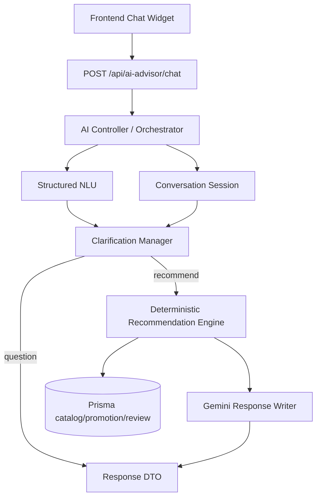
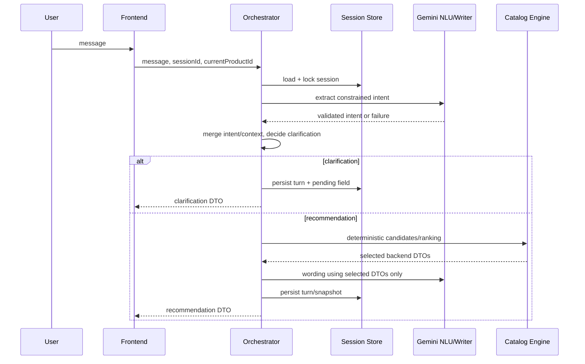
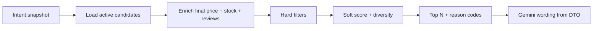

# Kiến trúc mục tiêu AI Chatbot (đề xuất, chưa triển khai)

## Quyết định ranh giới tin cậy

Backend là authority duy nhất cho product ID, candidate, price/final price, stock, promotion, category, filter, ranking, số lượng và no-result. Gemini chỉ trả structured intent hợp taxonomy hoặc natural-language wording dựa trên DTO backend; không được tác động DB/cart/wishlist/order.

## Component responsibilities

| Component | Trách nhiệm | Không được làm |
|---|---|---|
| Controller | validate transport, identity/session binding, correlation ID | parse/rank trực tiếp |
| Orchestrator | merge context, invoke NLU, clarification và engine | tin product/price từ model |
| Structured NLU | normalize/extract intent theo schema đóng | tạo taxonomy/ID mới |
| Session store | lưu intent snapshot, turns, pending clarification | dùng refresh token làm ID |
| Recommendation engine | query/enrich/filter/rank/diversify/reason | để Gemini chọn catalogue |
| Gemini writer | wording/reason từ candidate DTO | thêm fact/ID hoặc commerce action |

## Sequence đề xuất

## Current-state mapping

Giữ và bọc lại các phần đã có: active catalog query, promotion enrichment, approved-review aggregate, recommendation serialization và provider timeout/retry (`AI_CURRENT_ARCHITECTURE_AUDIT.md`). Không tái sử dụng support `ConversationMessage` cho guest AI nếu chưa có thiết kế ownership/retention riêng.

## Recommendation flow

Chi tiết contract, intent, clarification, ranking và store được tách tại [AI_CONVERSATION_CONTRACT.md](AI_CONVERSATION_CONTRACT.md), [AI_STRUCTURED_INTENT_SCHEMA.md](AI_STRUCTURED_INTENT_SCHEMA.md), [AI_CLARIFICATION_POLICY.md](AI_CLARIFICATION_POLICY.md), [AI_RECOMMENDATION_POLICY.md](AI_RECOMMENDATION_POLICY.md), [AI_SESSION_STORAGE_DECISION.md](AI_SESSION_STORAGE_DECISION.md).
